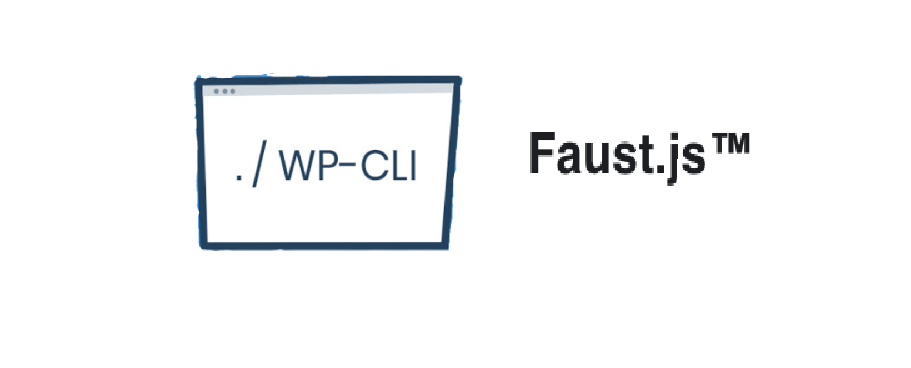

=== WPGraphQL ===
Contributors: Maurice
Tags: WP CLI, FaustJS
Requires PHP: 7.1
Stable tag: 1.0.0
License: GPL-3
License URI: https://www.gnu.org/licenses/gpl-3.0.html

=== Description ===

Adds two WP CLI commands

```bash

# List all the FaustJS settings.
wp faustjs settings

# Updates a specific setting.
wp faustjs update_setting --setting="front_end" --value="http://localhost:3000"

```

=== Dependencies ===
WP GraphQL
https://wordpress.org/plugins/faustjs/

```

```
